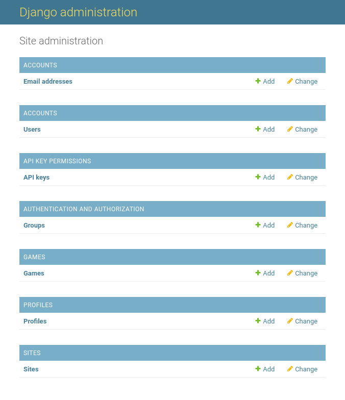

#### Code Over Time

This project is part of `Code Over Time`. For more information visit the [Code Over Time](http://www.codeovertime.com) website.

# Varcade Games


Varcade Games is a an online game portal for hosting single and multi player browser based games.

Game creators can connect to match maker and stat tracking services for their games and display their games alongside others in the game portal.

## Core Technologies Used

* [Django](https://www.djangoproject.com/)
* [Django rest framework](https://www.django-rest-framework.org/)
* [MySQL](https://www.mysql.com/)
* [Vue.js](https://vuejs.org/)

## Related Projects

This project contains everything you need to run `Varcade Games`, but this does not include matchmaker support or player stats tracking and does not actually contain any games. For that you will need to follow additional projects:

* [Matchmaker](https://github.com/theblacknight/matchmaker)
* [Stats Tracker](https://github.com/theblacknight/stats_tracker)
* [RPS Apocalypse](https://github.com/theblacknight/game_rps)

Each project contains it's own `Docker file` and can be run in isolation. But in order to easily manage all of the applications there is a `Build Tools` project with `Docker Compose` set up, along with some load generation scripts and other build and release related files:

* [Build tools](https://github.com/theblacknight/build_tools)

## Project Setup

### Clone the repo

First clone the repo for the Varcade Games Django backend and Vue.js client.

```
git clone https://github.com/theblacknight/website.git 
```

If you haven't already, clone the Build Tools project into the same directory as the Varcade Games source.

```
git clone https://github.com/theblacknight/build_tools.git 
```

### Build and run the images

Next we will build and run the required images for Varcade Games.

```
cd build_tools
make build a=game-portal
make build a=game-portal-client
make start a=game-portal
make start a=game-portal-client
```

You can check the status of the applications (a Mysql and Redis image will also be started) at any time by running:

```
make ps
```

You can view the log output for the client and server at any time by running `make logs` from within the build tools directory.

Or individually by running:

```
make logs a=game-portal
```

or 

```
make logs a=game-portal-client
```


### Set up the Varcade Games database

Next we need to set up the game database. 

You will need to connect your shell to the running game-portal container:

```
docker exec -it game-portal bash
```

Next run the following:

```
./manage.py migrate
./manage.py createsuperuser

```

You will be prompted to enter an email, username and password. You can enter anything you like at this point - but remember the details, as you will need those credentials to log in to the admin panel for Varcade Games.

You're all done here, so you can close this session on the docker container by typing `exit` and hitting return, or ctrl+c.

### Running the client

You should now be able to log in to Varcade Games.

Navigate your browser to `localhost:8002` to view the Varcade Games client.

You can log in here using the credentials that you provided in the previous step where you ran `./manage.py createsuperuser`.

There is, however, not much to look at.

In order to see some content we can add a placeholder game.

### Adding a game

Navigate your browser to `localhost:8000/admin`.

You should be greeted by a login page. Use the credentials that you provided in the early step where you ran `./manage.py createsuperuser`.

Once you've logged in you should see a menu that looks like this:



Click the `add` link under the `GAMES` category.

Fill in all of the fields with dummy data, for example:

* Game id: test_game
* Name: My Game
* Desc: A great game that you should play!
* Client url: empty
* Cover art: Upload the file `sample_game_cover.png` from `website/server/assets/sample/`
* Game type: SinglePlayerOnly
* Game State: Coming Soon

Hit save to create the game. 

We selected `Coming Soon` for `Game State` because we don't actually have a real game to hook up. This allows us to add a placeholder.

### Viewing your game

Navigate your browser back to `localhost:8002` again.

You should now see your new game in the `Coming Soon` section.

To add an actual game that you can play and play with others head over to the [game_rps](https://github.com/theblacknight/game_rps) project and follow the instructions there.